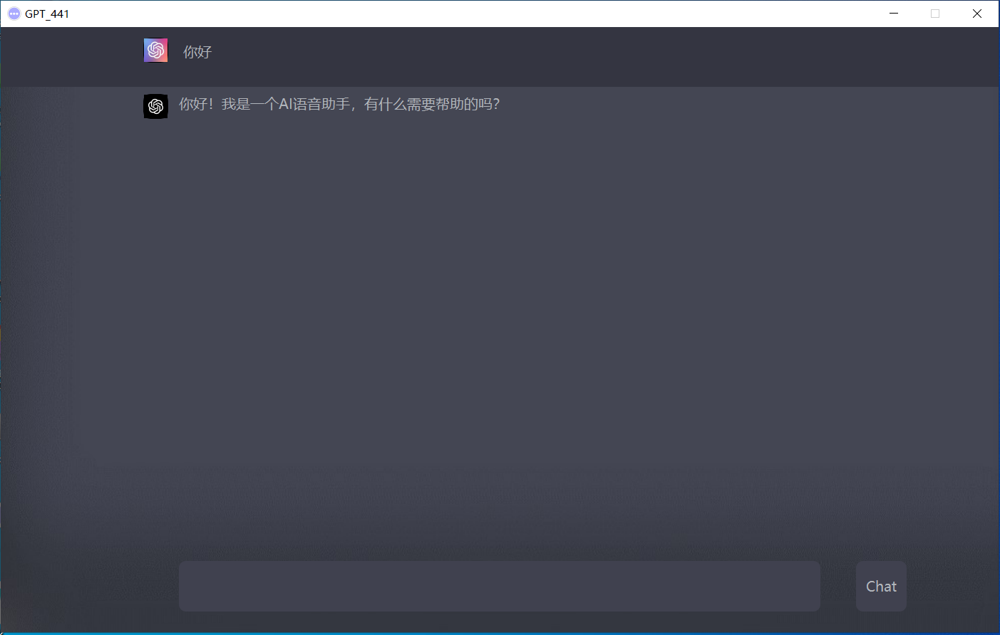

# 441 ChatGpt

## chat Gpt 441 2.1

v2.0回复：
1. (遗留)单次只能显示一个回答
2. (已解决)网络请求时，会出现整个界面卡顿
3. (已解决)输入框字体太大
4. (已解决)输入时整个页面被清空

## chat Gpt 441 2.0
界面如图：

v2.0反馈：
1. 单次只能显示一个回答
2. 网络请求时，会出现整个界面卡顿
3. 输入框字体太大
4. 输入时整个页面被清空

v1.0回复：
1. （已解决）问题与回答间距太近，多行文本时不便于观察
2. （已解决）输入法有时卡住或者出现多次输入
3. （已解决）网络连接掉线会直接闪退

## chat Gpt 441 1.0

界面如图：

v1.0反馈：
1. 问题与回答间距太近，多行文本时不便于观察
2. 输入法有时卡住或者出现多次输入
3. 网络连接掉线会直接闪退
